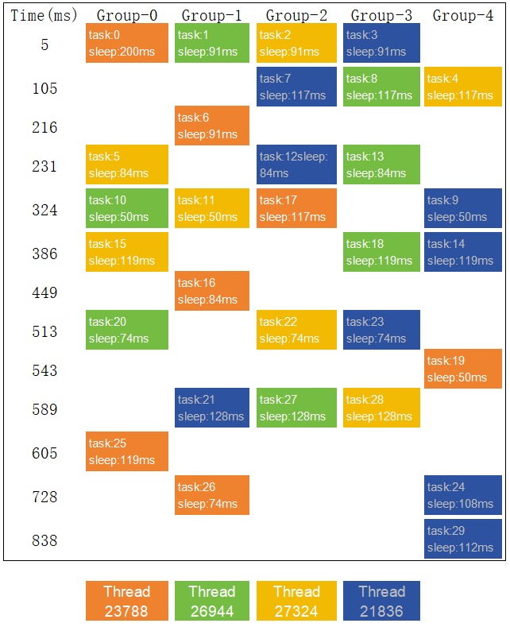

# SequentialThreadPool

A header-only thread pool in which tasks in the same group are executed in the order they are queued.

Basic usage:

```cpp
#include "SequentialThreadPool.hpp"
#include <iostream>
#include <sstream>

int main() {
    const auto start = std::chrono::high_resolution_clock::now();

    SequentialThreadPool pool(4);
    for (int task = 0; task < 30; ++task) {
        const int group = task % 5; // Task Grouping
        pool.post(group, [=]() {
            const auto end = std::chrono::high_resolution_clock::now();
            const auto duration = std::chrono::duration_cast<std::chrono::milliseconds>(end - start).count();
            const int sleep = task == 0 ? 200 : rand() % 100 + 50;
            std::stringstream ss;
            ss << "Time:" << duration << ", group:" << group << ", task:" << task
               << ", tid:" << std::this_thread::get_id() << ", sleep:" << sleep << "ms\n";
            std::cout << ss.str();
            std::this_thread::sleep_for(std::chrono::milliseconds(sleep));
        });
    }

    return 0;
}
```

Output：

```
Time:5,   group:0, task:0,  tid:23788, sleep:200ms
Time:5,   group:1, task:1,  tid:26944, sleep:91ms
Time:5,   group:2, task:2,  tid:27324, sleep:91ms
Time:5,   group:3, task:3,  tid:21836, sleep:91ms
Time:105, group:4, task:4,  tid:27324, sleep:117ms
Time:105, group:3, task:8,  tid:26944, sleep:117ms
Time:105, group:2, task:7,  tid:21836, sleep:117ms
Time:216, group:1, task:6,  tid:23788, sleep:91ms
Time:231, group:0, task:5,  tid:27324, sleep:84ms
Time:231, group:3, task:13, tid:26944, sleep:84ms
Time:231, group:2, task:12, tid:21836, sleep:84ms
Time:324, group:4, task:9,  tid:21836, sleep:50ms
Time:324, group:2, task:17, tid:23788, sleep:117ms
Time:324, group:1, task:11, tid:27324, sleep:50ms
Time:324, group:0, task:10, tid:26944, sleep:50ms
Time:386, group:0, task:15, tid:27324, sleep:119ms
Time:386, group:4, task:14, tid:21836, sleep:119ms
Time:386, group:3, task:18, tid:26944, sleep:119ms
Time:449, group:1, task:16, tid:23788, sleep:84ms
Time:513, group:0, task:20, tid:26944, sleep:74ms
Time:513, group:3, task:23, tid:21836, sleep:74ms
Time:513, group:2, task:22, tid:27324, sleep:74ms
Time:543, group:4, task:19, tid:23788, sleep:50ms
Time:589, group:1, task:21, tid:21836, sleep:128ms
Time:589, group:3, task:28, tid:27324, sleep:128ms
Time:589, group:2, task:27, tid:26944, sleep:128ms
Time:605, group:0, task:25, tid:23788, sleep:119ms
Time:728, group:1, task:26, tid:23788, sleep:74ms
Time:728, group:4, task:24, tid:21836, sleep:108ms
Time:838, group:4, task:29, tid:21836, sleep:112ms
```

Task execution order:


